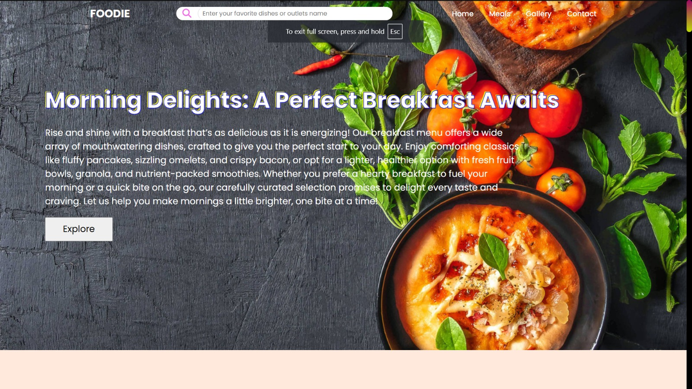
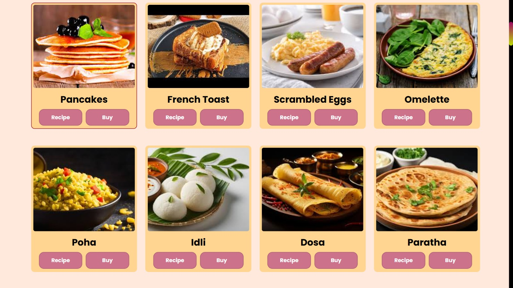
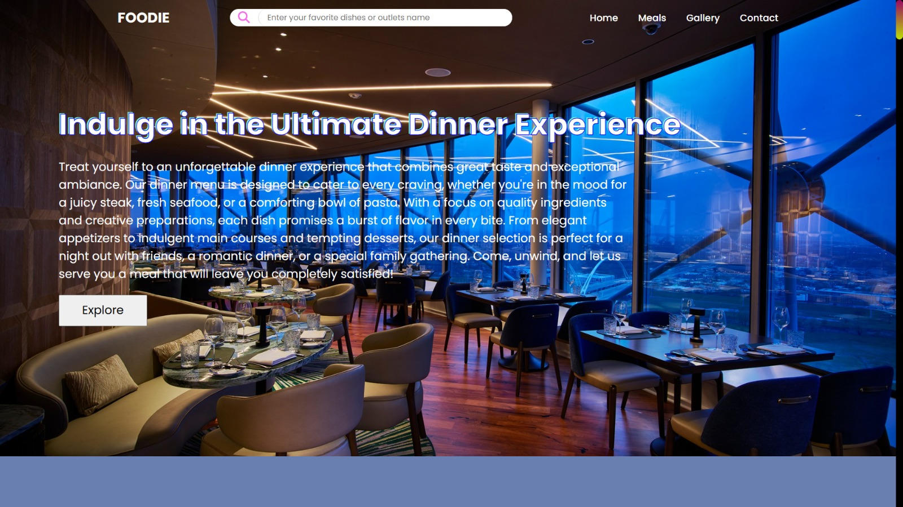
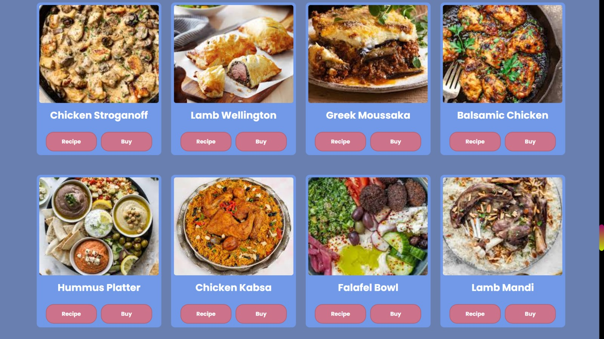
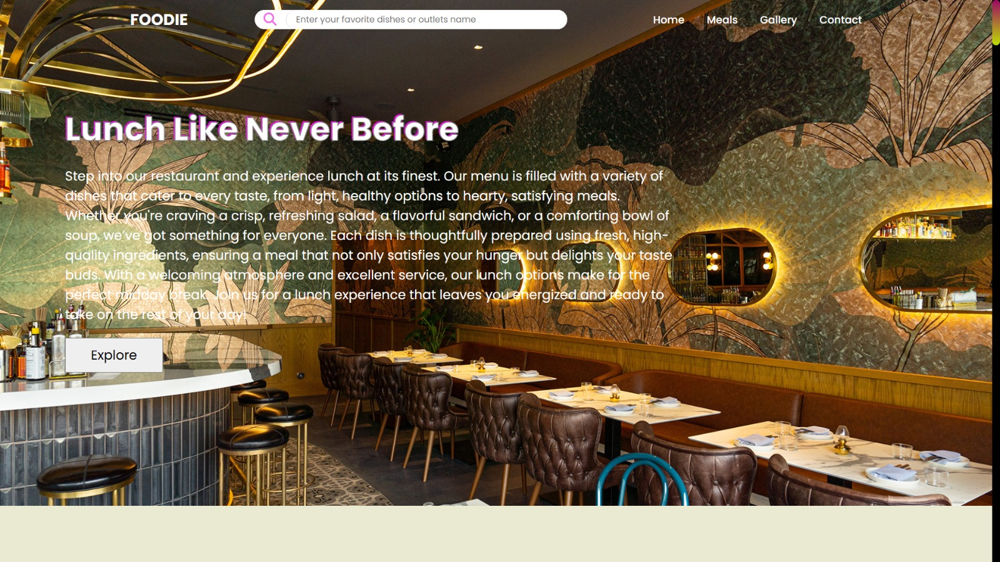
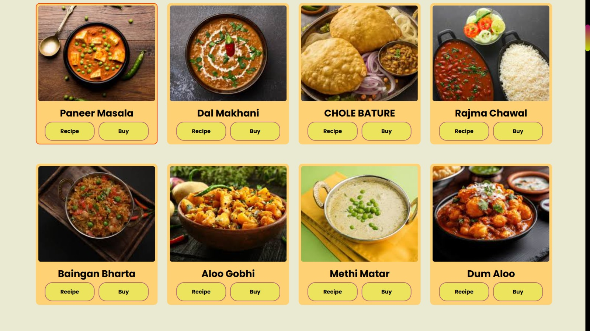

<h1 align="center">🥧 FOODIE ~ A FOOD WEBSITE</h1>

<h3>
✨ Developed by:
💡 Bitan Banerjee
💡 Anoy Ghosh
💡 Subhasis Das

💖 Made with passion for food lovers & web enthusiasts! 🌍🎉 
🚀 Created using HTML, CSS, JavaScript (Swiper.js, ScrollTrigger.js, GSAP.js) & Bootstrap
</h3>

<h1 align="center">🎨 Preview of Our Website</h1>  

 
   
 
   
 

<h1 align="center">📸 Our Gallery Pages 👆</h1>

 
   
 
   
 
   
 

<h1 align="center">🍽️ Our Breakfast, Lunch & Dinner Pages 👆</h1>
<h1 align="center">🙏 Thanks for visiting! 🎉🍽️😊</h1>
