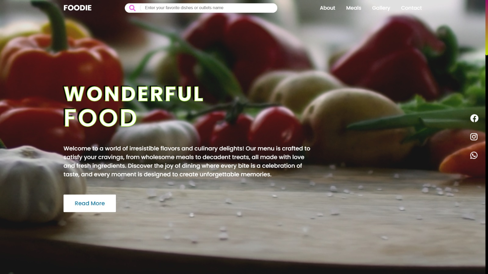
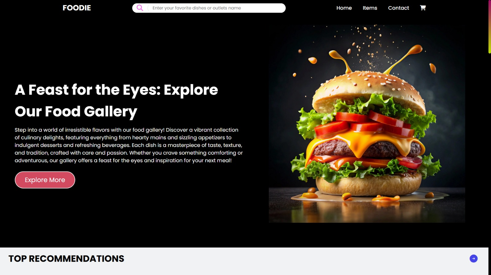
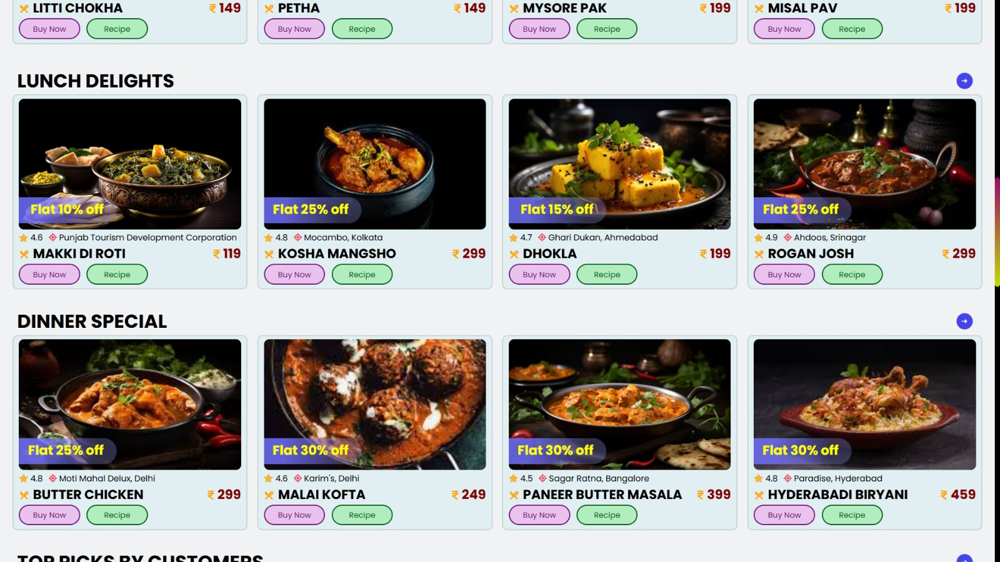
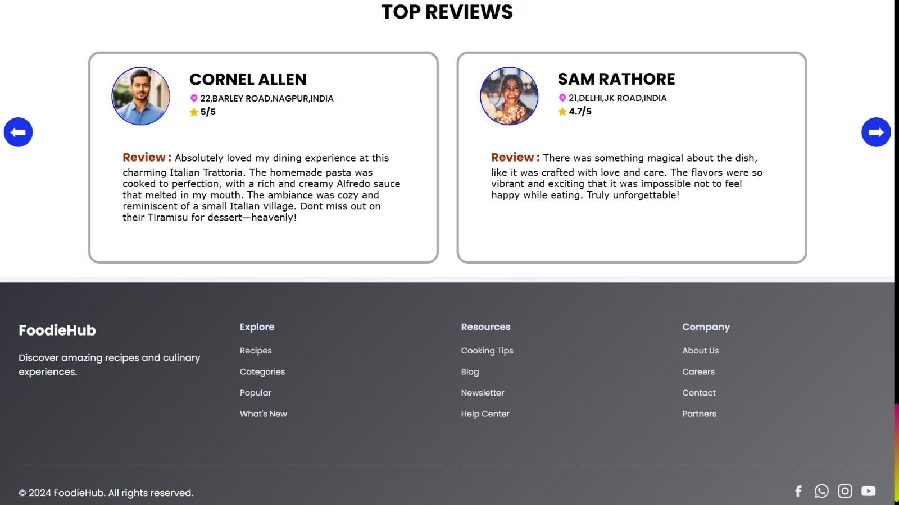

<h1 align="center">🥧 FOODIE ~ A FOOD WEBSITE</h1>

  <h3 align="center"><b>Created using HTML, CSS, JS (Swiper.js, ScrollTrigger.js, GSAP.js) and Bootstrap</b></h3>
  

    

        
        
    

    

        
        
    

<h4 align="center">Our Gallery Page</h4>

